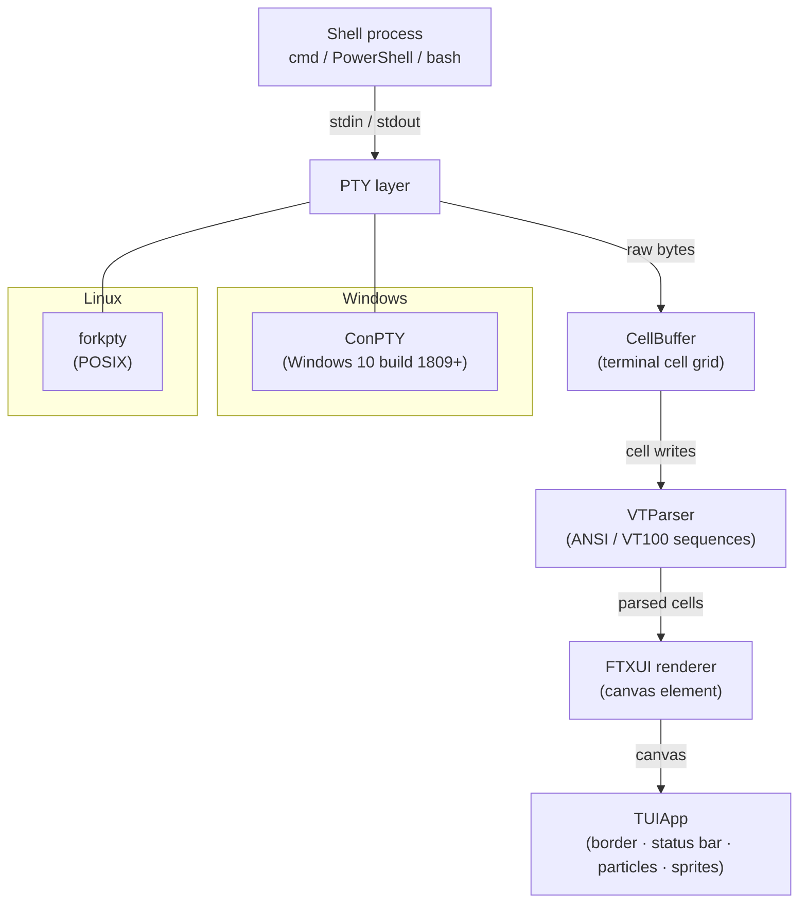

<div align="center">

<pre>
  *    .   *    .     *   .   *    .   *    .     *   .   *    .
.    *    .    *    .    *    .   *    .    *    .    *    .   *

                .---------------------------------------------------.
               |   .   .   T H E   D I S C W O R L D   .   .   .   |
               |   .   .   .   .   .   .   .   .   .   .   .   .   |
               |   .   .   .   .   .   .   .   .   .   .   .   .   |
                `---------------------------------------------------'

                         ||          ||          ||          ||
                         ||          ||          ||          ||
                        / \         / \         / \         / \

        .-.    ╔═════════════════════════════════════════════════════╗
       (. .)   ║  ~   ~   ~   ~   ~   ~   ~   ~   ~   ~   ~   ~   ~ ║
        `-'    ║  ~   ~   ~   G R E A T   A ' T U I N   ~   ~   ~   ║
        /|\    ║  ~   ~   ~   ~   ~   ~   ~   ~   ~   ~   ~   ~   ~ ║
       / | \   ╚═════════════════════════════════════════════════════╝
          ~~~~\──────────────────────────────────────────────/~~~~
               \_________________________________________________/

  *    .   *    .   *    .     *   .   *    .   *    .     *   .   *
.    *    .    *    .   *    .    *    .    *    .   *    .    *    .
</pre>

# Terry

*a Discworld-flavoured terminal wrapper*

[](https://en.cppreference.com/w/cpp/17)
[](https://cmake.org)
[](https://github.com/vimplusplus/Terry)
[](https://github.com/vimplusplus/Terry)
[](LICENSE)

</div>

---

Terry wraps any shell — cmd, PowerShell, bash — in an animated Discworld terminal. The shell underneath is completely untouched. It just looks like something Death would use.

---

## Features

| | |
|---|---|
| **Octarine border** | Breathes through deep purple → electric green → mid purple. Continuous. |
| **Boot sequence** | Great A'Tuin ASCII art, then Death greets you personally. Every time. |
| **Magic particles** | Faint glyphs drift across the background. Cosmetic. Entirely necessary. |
| **The Luggage** | Walks the status bar on hundreds of tiny legs, going somewhere important. |
| **Rincewind** | Appears at the top of the screen every few minutes. Still running. |
| **Sardonic chrome** | All UI text speaks in Discworld vocabulary. The shell output never does. |

---

## Architecture



---

## How It Works

- **Child shell** — Terry spawns your configured shell as a child process and wires a PTY between them. The shell believes it has a real terminal.
- **PTY layer** — On Windows, `CreatePseudoConsole` (ConPTY, requires build 1809+). On Linux, `forkpty()`. Either way the abstraction is identical above this layer.
- **VT parsing** — Raw bytes from the PTY are scanned for ANSI/VT100 escape sequences (cursor movement, SGR colour, erase ops) and applied to an internal `CellBuffer` grid.
- **FTXUI render loop** — The cell grid is painted into an FTXUI canvas element at ~60 fps. Every frame is a full repaint through FTXUI's diff engine.
- **Animated overlay** — `TUIApp` composites the octarine border, particle system, Luggage sprite, and Rincewind sprite on top of the cell canvas each frame. The shell never sees any of it.

---

## Build

> **Requirements:** C++17 compiler · CMake 3.16+ · internet connection (FTXUI fetched automatically at configure time)

### Windows

```powershell
cmake -B build -G "Visual Studio 17 2022" -A x64
cmake --build build --config Release
.\build\Release\terry.exe
```

### Linux

```bash
cmake -B build -DCMAKE_BUILD_TYPE=Release
cmake --build build
./build/terry
```

Tested on Windows 10 22H2, Windows 11, Ubuntu 22.04, Arch Linux.

---

## Configuration

| Platform | Config file |
|---|---|
| Windows | `%APPDATA%\terry\config` |
| Linux | `~/.terry` |

```ini
shell=C:\Windows\System32\WindowsPowerShell\v1.0\powershell.exe
```

Absent file → platform default (`cmd.exe` on Windows, `/bin/bash` on Linux).

---

## The Characters

| Character | Where they appear |
|---|---|
| **DEATH** | Boot greeting · status bar label · farewell on exit |
| **The Luggage** | Status bar. Silent. Purposeful. Going somewhere. |
| **Rincewind** | Top of screen every few minutes. Always running. |

---

## Supported Platforms

| Platform | PTY driver | Shell support |
|---|---|---|
| Windows 10 build 1809+ | ConPTY | cmd, PowerShell, any `.exe` |
| Linux | forkpty | bash, zsh, fish, any POSIX shell |

---

## Project Structure

```
Terry/
├── CMakeLists.txt                # Build — FTXUI via FetchContent, platform sources
├── README.md
├── include/
│   ├── animations.h              # Luggage + Rincewind sprite declarations
│   ├── boot_sequence.h           # A'Tuin art + Death boot script declarations
│   ├── cell_buffer.h             # Internal terminal cell grid
│   ├── config.h                  # Shell path config loader
│   ├── particle_system.h         # Background magic particle declarations
│   ├── shell_host.h              # Platform-agnostic PTY host interface
│   ├── theme.h                   # Octarine colour constants
│   ├── tui_app.h                 # Main TUI application class
│   └── vt_parser.h               # ANSI/VT100 escape sequence parser
└── src/
    ├── animations.cpp            # Luggage walk frames, Rincewind sprite
    ├── boot_sequence.cpp         # Great A'Tuin ASCII art, Death boot dialogue
    ├── cell_buffer.cpp           # Terminal grid read/write logic
    ├── config.cpp                # Config file discovery and parsing
    ├── main.cpp                  # Entry point
    ├── particle_system.cpp       # Particle spawn, drift, and fade
    ├── shell_host_posix.cpp      # forkpty PTY implementation (Linux)
    ├── shell_host_windows.cpp    # ConPTY implementation (Windows)
    ├── tui_app.cpp               # FTXUI render loop and animated overlay
    └── vt_parser.cpp             # VT sequence state machine
```

---

## Licence

MIT — see [LICENSE](LICENSE).

[](LICENSE)

*GNU Terry Pratchett*
